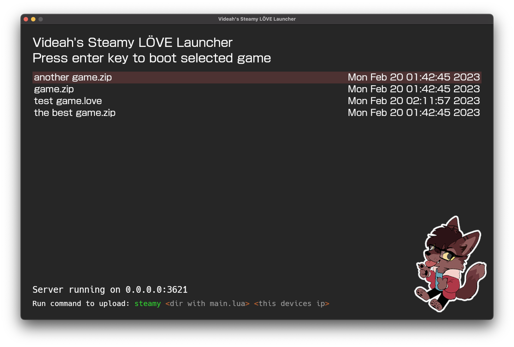

# Videah's Steamy Remote LÖVE Launcher



`steamy` is a development tool for [LÖVE](https://love2d.org) that faciliates easy remote development of games,
primarily created and designed to be used for developing games on [Steam Deck](https://store.steampowered.com/steamdeck)
but can be used on other devices.

You can use `steamy` to receive, send, and launch game files remotely. There is no need to package a .love, all
the bundling is done for you. This allows rapid development when testing on different devices than the one you
develop with.

**Note:** `steamy` depends on [LuaJIT's FFI capabilities](http://luajit.org/ext_ffi.html) to function and won't be
useful on platforms where JIT and FFI are not available.

# Usage
```
Usage: steamy [--port <port>] [--name <name>] [--upload-only]
       [--server-mode] [-h] <dir> [<host>]

Steamy Remote Launcher

Arguments:
   dir                   Directory that contains main.lua
   host                  IP or hostname of a server.
                         In client mode, this is the server to connect to.
                         In server mode, this is the address that will be bound to.
                          (default: 127.0.0.1)

Options:
   --port <port>         Port (default: 3621)
   --name <name>         Name of game zip file sent to server. (default: game)
   --upload-only         Don't automatically boot game after uploading.
   --server-mode         Run in server mode, allows remote users to load/boot games.
   -h, --help            Show this help message and exit.
```

## Libraries Used
- [LoveZip](https://github.com/Rami-Sabbagh/LoveZip)
- [nativefs](https://codeberg.org/pgimeno/nativefs)
- [bitser](https://github.com/gvx/bitser)
- [sock.lua](https://github.com/camchenry/sock.lua)
- [pprint.lua](https://github.com/jagt/pprint.lua)